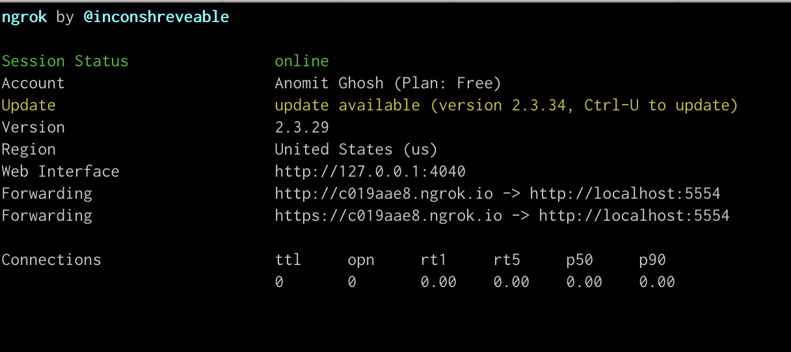
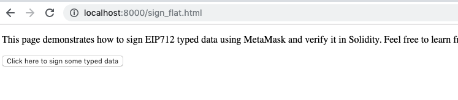
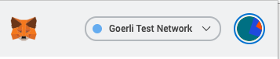
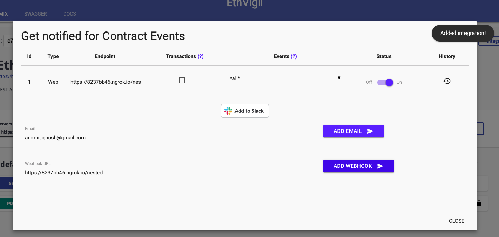
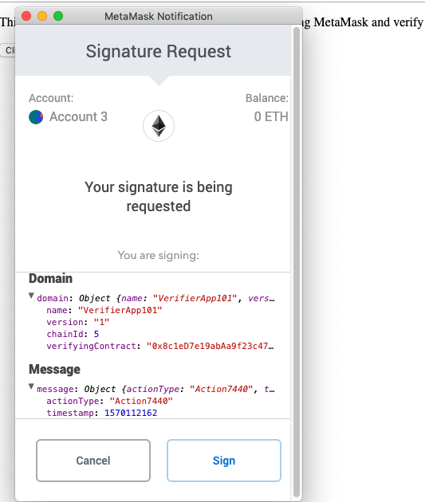
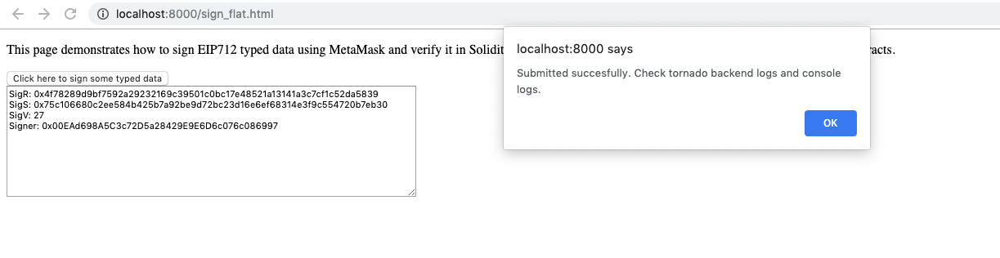
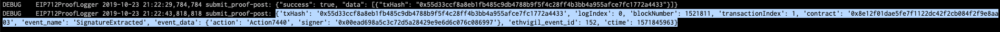
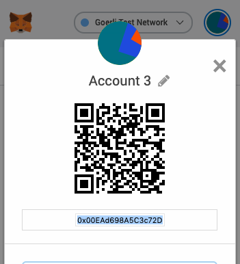
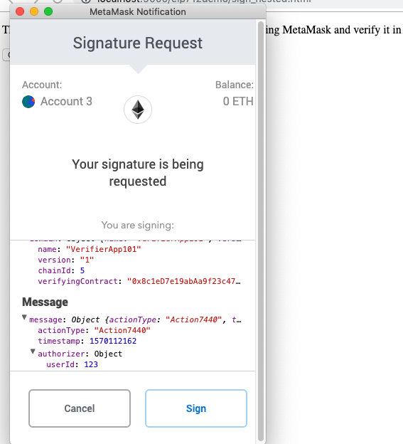

## `eth_signTypedData`- EIP-712 compliant signing

The guide will introduce you to sending and verifying an offline signed message **(with a clearly defined and presented data type schema)** to a smart contract via the EthVigil API endpoints.
The signing method used to demonstrate this example is the currently standardized [`eth_signTypedData`](https://github.com/ethereum/EIPs/blob/master/EIPS/eip-712.md) as part of the EIP-712 documentation.

The verification happens on contract and we monitor corresponding events for that in a webhook integration.


### Please refer to [this doc](https://ethvigil.com/docs/eip712_sign_example_code/) for a detailed walkthrough and explanation.

## How to run this example

### Populate `settings.json`
Rename `settings.example.json` to `settings.json`

These are the initial contents of the file:

```json

  "development": {
    "REST_API_ENDPOINT": "https://beta-api.ethvigil.com/v0.1",
    "INTERNAL_API_ENDPOINT": "https://beta.ethvigil.com/api",
    "ETHVIGIL_USER_ADDRESS": "0xaddr",
    "ETHVIGIL_API_KEY": "1212-1212-12-12"
  }
}


```
Enter the appropriate values for the following keys
* `ETHVIGIL_USER_ADDRESS` -- associated with the above private key
* `ETHVIGIL_API_KEY` -- a token passed in HTTP request headers to authenticate POST calls. Works with GET calls too.

>Hint: If you have `ev-cli` installed, you can use [dumpsettings](https://ethvigil.com/docs/cli_onboarding#backup-settings-and-recover-later) to recover your EthVigil credentials

### Python

`pip install -r requirements.txt`

`python submit_proof.py`

### Run `ngrok`
Open another terminal window/tab.

Tunnel it to port 6635 on localhost

`./ngrok http 6635`

We will need the link [to set up webhook integration](https://ethvigil.com/docs/web_onboarding/#adding-integrations) on the `SignatureExtracted` event emitted fom the contracts.



### Deploy the smart contracts

* [EIP712FlatStruct.sol](https://github.com/blockvigil/api-usage-examples/blob/master/EIP-712/EIP712FlatStruct.sol)
* [EIP712NestedStruct.sol](https://github.com/blockvigil/api-usage-examples/blob/master/EIP-712/EIP712NestedStruct.sol)

Note down the deployed contract addresses. `0x8e12f01dae5fe7f1122dc42f2cb084f2f9e8aa03` and  `0x583e7a6f0de3ecbe8e878878d5ac5c19bc1c807e` respectively, for this example, on the Goerli Ethereum Test network.

* [Deploy with EthVigil web UI](https://ethvigil.com/docs/web_onboarding/#deploy-a-solidity-smart-contract)
* [Deploy with EthVigil command line  tool](https://ethvigil.com/docs/cli_onboarding/#deploy-a-solidity-smart-contract)

### Setting up the frontend
* `sign_flat.html` & `sign.js`
* `sign_nested.html` & `sign_nested.js`

Arrange these to be served through a server. For this example, we will use the Python 3 module http.server directly from the command line for a quick setup. 

```
python3 -m http.server

Serving HTTP on 0.0.0.0 port 8000 (http://0.0.0.0:8000/) ...
127.0.0.1 - - [24/Oct/2019 19:13:16] "GET /sign_flat.html HTTP/1.1" 200 - 
``` 

Now the frontend can be accessed through the browser at `http://localhost:8000`


On further interaction, `sign.js` or `sign_nested.js` launches Metamask to generate a 65 byte signed data that is sent to the python script, [`submit_proof.py`](https://github.com/blockvigil/api-usage-examples/blob/master/EIP-712/submit_proof.py)

### Switch Metamask network to Goerli test net



This is necesssary because Metamask places a strict check on the network ID specified in the data message object sent to `eth_signTypedData`. And all our signed messages are sent to contracts deployed on this specific test network, Goerli. 

### Configure webhook integration with deployed contracts

Find out the ngrok forwarding URL from [the above section](README.md#run-ngrok)

Add the ngrok URL as a webhook integration with a trailing `/webhook` path, for eg, `https://8237bb46.ngrok.io/flat`



### Edit javascript files

Fill in the respective deployed contract addresses for the flat and nested struct examples in `sign.js` and `sign_nested.js`. Find the section at the end where the script sends a XHR to the python tornado server running at `http://localhost:6635`

```js
 var data = JSON.stringify({
    command: 'submitProof',
    // replace the following with the deployed EIP712FlatStruct.sol contract address
    contractAddress: '0x8e12f01dae5fe7f1122dc42f2cb084f2f9e8aa03',
    messageObject: message,
    sigR: signature.r,
    sigS: signature.s,
    sigV: signature.v,
    signer: signer

});

xhr.send(data); 
```

### Putting it all together

Visit either `sign_flat.html` or `sign_nested.html`. [According to our section on setting up the frontend](README.md#setting-up-the-frontend) they will be available at
* http://localhost:8000/sign_flat.html
* http://localhost:8000/sign_nested.html

#### Sign a flat structured typed message object
Click on the button on the page. It should cause Metamask to pop up a new window. Observe the message object contents and typed schema.



Sign and you should see something like this:


Check the `python submit_proof.py` logs

``` 
{
    'command': 'submitProof', 
    'contractAddress': '0x8e12f01dae5fe7f1122dc42f2cb084f2f9e8aa03', 
    'messageObject': {
        'actionType': 'Action7440', 
        'timestamp': 1570112162, 
        'authorizer': 'auth239430'
    }, 
    'sigR': '0x4f78289d9bf7592a29232169c39501c0bc17e48521a13141a3c7cf1c52da5839', 
    'sigS': '0x75c106680c2ee584b425b7a92be9d72bc23d16e6ef68314e3f9c554720b7eb30', 
    'sigV': 27, 
    'signer': '0x00EAd698A5C3c72D5a28429E9E6D6c076c086997'
}

{"success": true, "data": [{"txHash": "0x55d33ccf8a8eb1fb485c9db4788b9f5f4c28ff4b3bb4a955afce7fc1772a4433"}]}

```
>This is an actual tx on the goerli testnet. You can verify it on [Etherscan explorer](https://goerli.etherscan.io/tx/0x55d33ccf8a8eb1fb485c9db4788b9f5f4c28ff4b3bb4a955afce7fc1772a4433)

Soon the python script will also receive the event data payload corresponding to the `SignatureExtracted` event

```
{
    'txHash': '0x55d33ccf8a8eb1fb485c9db4788b9f5f4c28ff4b3bb4a955afce7fc1772a4433', 
    'logIndex': 0, 
    'blockNumber': 1521811, 
    'transactionIndex': 1, 
    'contract': '0x8e12f01dae5fe7f1122dc42f2cb084f2f9e8aa03', 
    'event_name': 'SignatureExtracted', 
    'event_data': {
        'action': 'Action7440', 
        'signer': '0x00ead698a5c3c72d5a28429e9e6d6c076c086997'
     }, 
     'ethvigil_event_id': 152, 
     'ctime': 1571845963
 } 
```


Observe `['event_data']['signer']` is `0x00ead698a5c3c72d5a28429e9e6d6c076c086997`

That's the address I used to sign the above typed structured data.




#### Sign a nested structured typed message object

Visit the `sign_nested.html` file and follow the similar steps as mentioned above.

Observe how the nested data structure shows up on the signing alert window.



Check the `submit_proof.py` logs as described above.